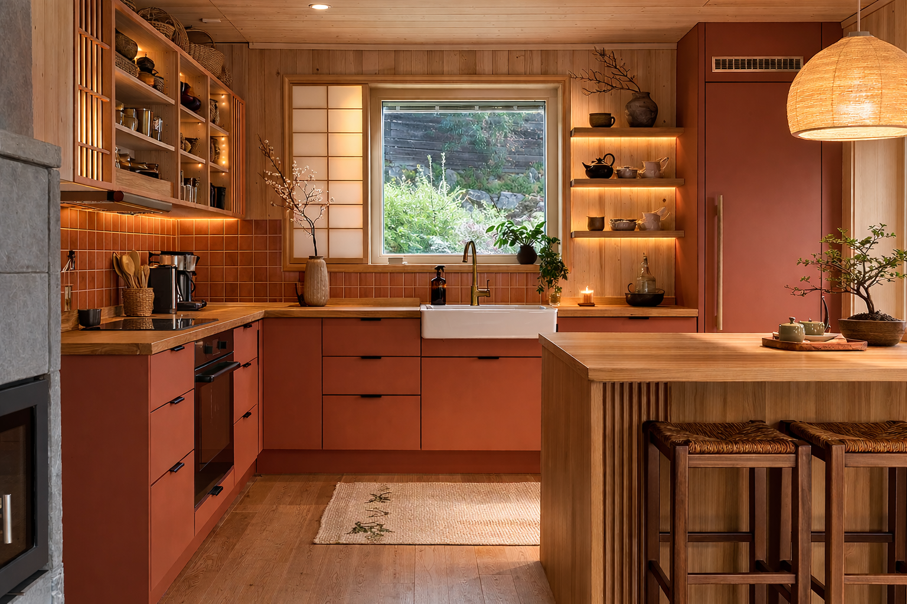

# Kjøkken

## Planer

| Kva | Kompleksitet | Kostnad | Utføring |
|---|---|---|---|
| Male kjøkkenfrontane | Lav | 2 000 kr | Sjølv |
| Fjerne det store skapet over langsida | Lav | 0 kr | Sjølv |
| Lage en enkelthylle på toppen av flisene | Lav | 1 500 kr | Sjølv |
| Lage sittebenk | Lav | 3 000 kr | Sjølv |
| Fliselegge bak peisen | Middels | 5 000 kr | Handverkar |
| Fliselegge bak benkeplata | Middels | 5 000 kr | Handverkar |
| Bytte ut vifte og rør for ventilasjon | Middels | 8 000 kr | Handverkar |
| Sette opp skillevegg | Middels | 15 000 kr | Handverkar |

## Idéer

-

## Bilder/inspirasjon

